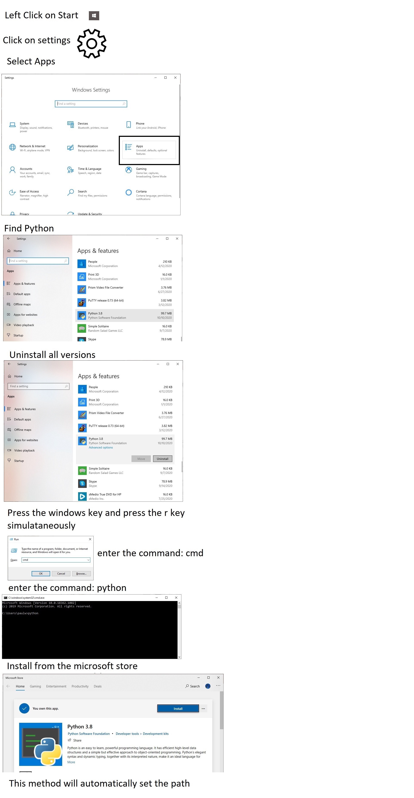
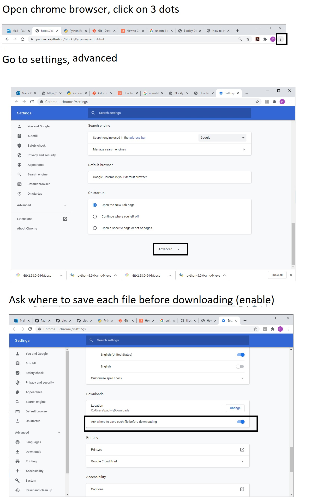

<h1>Setup</h1>

<h2>Install Pypthon</h2>

<h2>Install git for windows</h2>
<ul>  
   <li>Download git for windows from <a href="https://github.com/git-for-windows/git/releases/download/v2.28.0.windows.1/Git-2.28.0-64-bit.exe">here</a>
   <li>Double click the git executable for windows to install</li>
   <li>Open a cmd windows (windows-r), cmd </li>
   <li>cd .., cd ..</li>
   <li>git clone https://www.github.com/Paulware/pyGame</li>
</ul>

<h2>Chrome Setup</h2>
 
<a href="http://Paulware.github.io/blocklyPygame/index.html">Docs</a>

       
       